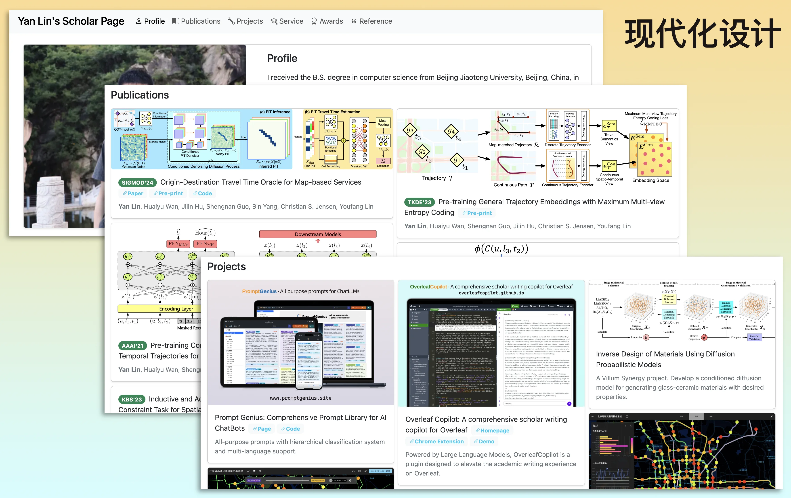
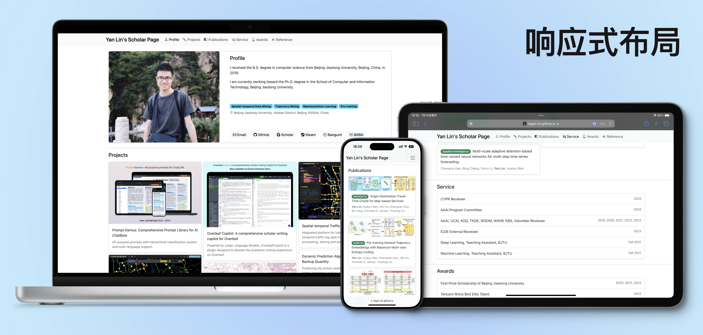
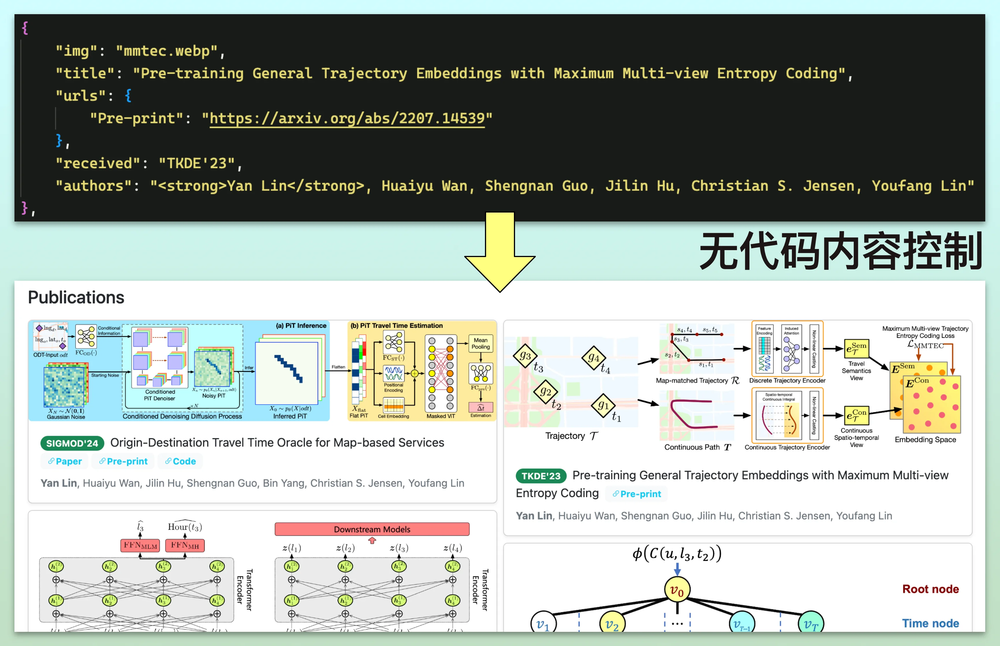
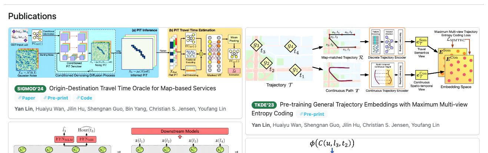

# Yan Lin's Scholar Page

A Contemporary, User-Friendly, and No-Code Scholar Page.

## Key Features

### Contemporary Design

Balanced elegance for a scholar page, designed to highlight your academic achievements attractively.



### Adaptive Layout

Ensures optimal viewing on any device.



### No Coding Needed

Manage your content effortlessly with an intuitive data file. No need for HTML expertise.



### Pure Frontend

Operates without the need for a backend server, compatible with complimentary hosting services such as GitHub Pages.

## Live Example

Explore my scholar page, a real-world application of this framework, at https://logan-lin.github.io/.

## Usage

To create your own scholar page, simply update `data.js` with your information.

`data.js` organizes your content into JSON variables, each representing a different page section. For instance, the `publications` variable looks like this:

```js
const publications = [
    {
        "img": "dot.webp",
        "title": "Origin-Destination Travel Time Oracle for Map-based Services",
        "urls": {
            "Paper": "https://dl.acm.org/doi/10.1145/3617337",
            "Pre-print": "https://arxiv.org/abs/2307.03048",
            "Code": "https://github.com/Logan-Lin/DOT"
        },
        "received": "SIGMOD'24",
        "authors": "<strong>Yan Lin</strong>, Huaiyu Wan, Jilin Hu, Shengnan Guo, Bin Yang, Christian S. Jensen, Youfang Lin"
    },
    {
        "img": "mmtec.webp",
        "title": "Pre-training General Trajectory Embeddings with Maximum Multi-view Entropy Coding",
        "urls": {
            "Pre-print": "https://arxiv.org/abs/2207.14539"
        },
        "received": "TKDE'23",
        "authors": "<strong>Yan Lin</strong>, Huaiyu Wan, Shengnan Guo, Jilin Hu, Christian S. Jensen, Youfang Lin"
    }
]
```

This array outlines the specifics of your publications, which are then dynamically rendered on your page:



Given the straightforward design of `data.js`, customizing your scholar page is a breeze, requiring no programming knowledge.

To share your scholar page, upload it to a free hosting service like GitHub Pages. For more details on hosting, visit https://pages.github.com/.

## Acknowledgements

Should you decide to construct your academic page utilizing my framework, I would deeply appreciate it if you could acknowledge me by incorporating a link in the footer. This can be accomplished by adjusting the `footer_links` variable within `data.py`, as demonstrated below:

```js
const footer_links = [
    {
        "text": "YL's Page",
        "url": "https://logan-lin.github.io/"
    },
  	...
]
```

Your support means a great deal to me! If you have any recommendations or feedback, please do not hesitate to share them by posting a Github Issue or contacting me via email at linyanwd@icloud.com.